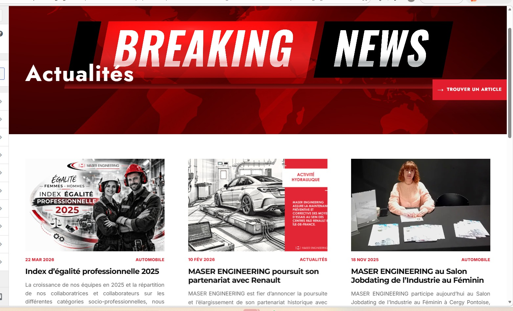
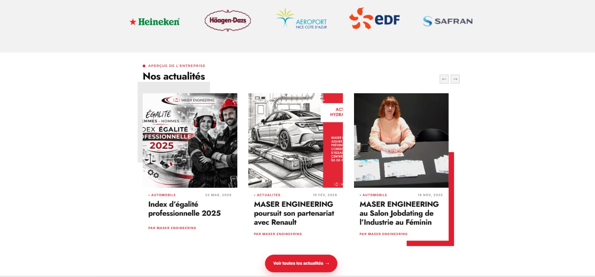
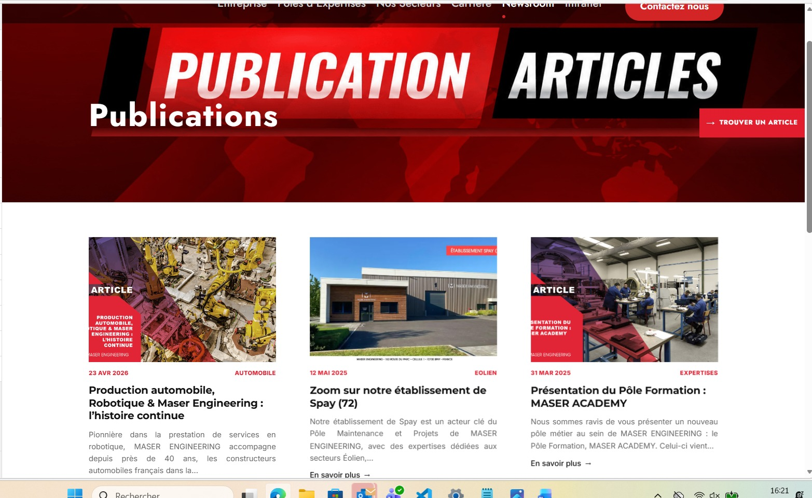

# WP Newsroom Auto Feed

Plugin WordPress permettant d’afficher automatiquement les actualités et publications selon les catégories, avec une logique optimisée pour le contenu et le SEO.

---

## 🎯 Problème

Sur un site corporate, les actualités et publications doivent souvent être affichées à plusieurs endroits (homepage, pages internes, blocs spécifiques).

Résultat :
- gestion manuelle répétitive
- risques d’oubli ou d’incohérence
- difficulté à maintenir un maillage interne efficace

---

## 💡 Solution

WP Newsroom Auto Feed automatise l’affichage des articles WordPress selon les catégories, tags ou zones du site grâce à des shortcodes personnalisés.

---

## 🚀 Bénéfices

- Gain de temps dans la gestion éditoriale  
- Affichage automatique des contenus récents  
- Cohérence globale des publications  
- Amélioration du maillage interne  
- Optimisation SEO du contenu  

---

## 🖼️ Aperçu

### 📰 Bloc actualités


### 🏠 Homepage


### 📄 Page publications


---

## 🔗 Shortcodes

### 📌 Article mis en avant
```text
[zeb_news_featured category="actualites" posts="1"]
```

### 📰 Flux d’actualités
```text
[zeb_news_feed category="actualites" posts="6" title="Nos actualités"]
```

### 📄 Flux de publications
```text
[zeb_news_feed category="publications" posts="6" title="Nos publications"]
```

### 🏠 Bloc homepage
```text
[zeb_home_news category="actualites" posts="4" title="Nos actualités"]
```

---

## ⚙️ Fonctionnement

Le plugin utilise `WP_Query` pour récupérer dynamiquement les contenus et les injecter via des shortcodes personnalisés.  

Des animations et interactions sont ajoutées avec JavaScript (`IntersectionObserver`).

---

## 🛠️ Stack

- PHP  
- WordPress  
- WP_Query  
- Shortcodes WordPress  
- JavaScript  
- CSS responsive  
- IntersectionObserver  

---

## 📦 Installation

1. Copier le dossier du plugin dans :

```bash
wp-content/plugins/wp-newsroom-auto-feed/
```

2. Activer le plugin depuis l’administration WordPress :

```text
Extensions > Activer
```

3. Utiliser les shortcodes dans les pages WordPress

---

## 🗂️ Structure du plugin

```text
wp-newsroom-auto-feed/
├── wp-newsroom-auto-feed.php
├── README.md
└── assets/
    ├── css/
    │   └── newsroom.css
    └── js/
        └── newsroom.js
```

---

## 👤 Auteur

Sévérin OGAH